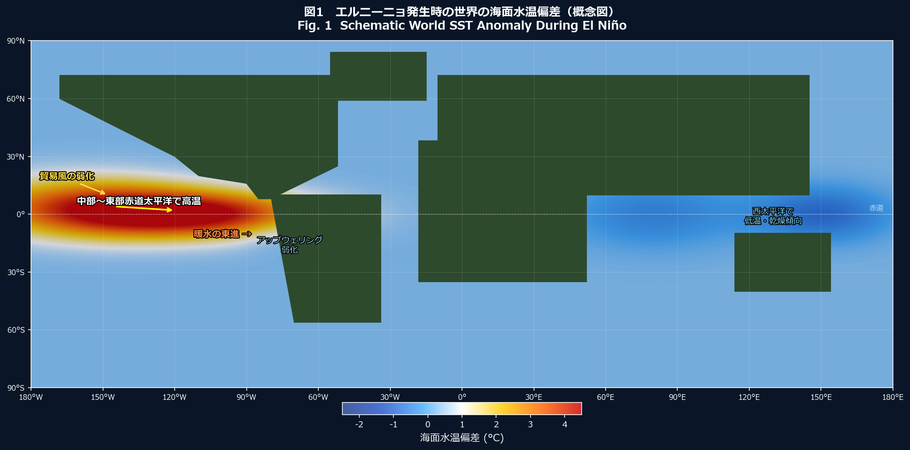
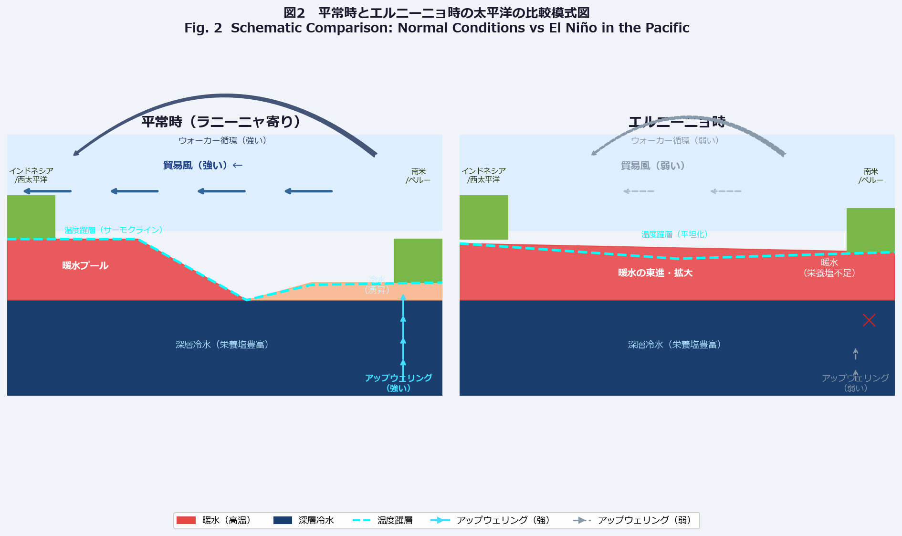
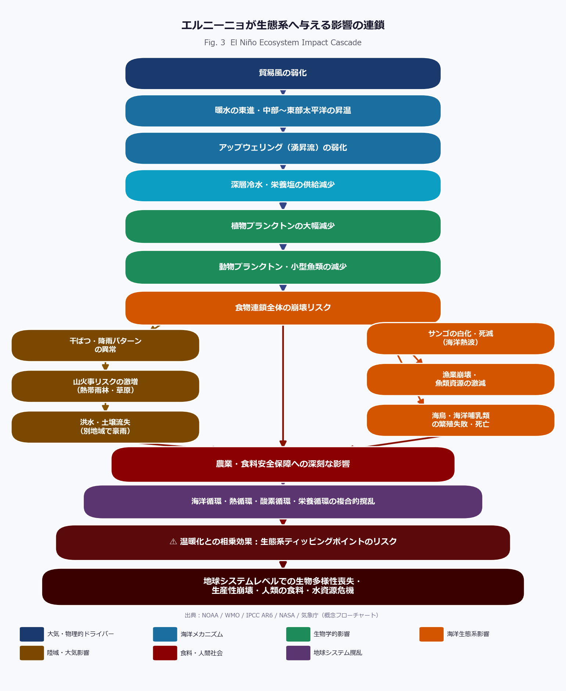

# エルニーニョ・スーパーエルニーニョと地球温暖化が生態系に与える影響
## ——海洋循環の崩壊から食料・生物多様性危機へ——

> **著者：** マスター / inchacomusho　｜　**協力AI：** G（ChatGPT）　｜　**日付：** 2026年6月2日
> **ライセンス：** [CC BY 4.0](https://creativecommons.org/licenses/by/4.0/deed.ja)

---

## 要旨（Abstract）

エルニーニョは、数年に一度発生する大規模な気候変動現象であり、熱帯太平洋の海面水温（SST）が平年より顕著に高くなることで、大気・海洋・陸域・生態系に連鎖的な影響をもたらす。近年の地球温暖化の進行により、エルニーニョの強度と影響範囲は拡大しつつある。特に「スーパーエルニーニョ」と呼ばれる極端に強いイベントは、海洋の熱循環・水循環・栄養循環・酸素循環を複合的に撹乱し、植物プランクトンの激減、漁業崩壊、サンゴ礁の白化、海洋熱波、干ばつ、洪水、山火事、農業危機という多重ショックを地球規模で引き起こす。本稿では、エルニーニョの物理メカニズムから生態系への影響連鎖、温暖化との相乗効果、そして生態系ティッピングポイントのリスクまでを、最新の科学的知見に基づいて体系的に解説する。

---

## ポイント一覧（Key Points）

| # | ポイント |
|---|--------|
| 1 | エルニーニョは太平洋熱帯域の貿易風弱化により暖水が東進する自然現象（ENSO）。 |
| 2 | 「スーパーエルニーニョ」は非公式な呼称だが、SST偏差が特に大きい（＋2°C以上）極端事例を指す。 |
| 3 | 地球温暖化により海洋ベースラインSSTが上昇し、エルニーニョのピーク温度も底上げされる。 |
| 4 | アップウェリング（湧昇流）の弱化が栄養塩供給を断ち、植物プランクトンが激減する。 |
| 5 | 植物プランクトン減少は海洋食物連鎖全体を崩壊させる可能性がある。 |
| 6 | サンゴ礁への温度上昇ストレスが白化・死滅を加速する。 |
| 7 | 干ばつ・山火事・洪水・農業損失が同時多発的に発生する。 |
| 8 | 生態系ティッピングポイントを超えると、不可逆的な生態系崩壊が生じるリスクがある。 |

---

## 1. エルニーニョとは何か

**エルニーニョ（El Niño）** とは、熱帯太平洋の中部から東部にかけての海面水温（SST）が、平年より**0.5°C以上高い状態が5か月以上継続する現象**を指す。スペイン語で「幼子イエス（神の子）」を意味し、ペルー沖の漁師たちがクリスマス頃に感じる暖流に因んで名付けられた \[1\]。

エルニーニョは単独の現象ではなく、**ENSO（El Niño–Southern Oscillation：エルニーニョ南方振動）** という大規模な大気海洋相互作用の一部である。ENSOには、エルニーニョ（海面水温が高い側）とラニーニャ（海面水温が低い側）の両方の位相がある \[2\]。

### 発生周期

エルニーニョは、おおむね**2〜7年に1回**の周期で発生する。ただしその強度や継続期間は毎回異なり、予測困難な複雑系的挙動を示す。

### 主要な監視指標

| 指標 | 説明 |
|------|------|
| **Niño 3.4領域のSST偏差** | 太平洋中部〜東部（5°N〜5°S、170°W〜120°W）の海面水温偏差 |
| **ONI（Oceanic Niño Index）** | Niño 3.4の3か月移動平均偏差。±0.5°C超えが判定基準 \[3\] |
| **SOI（南方振動指数）** | タヒチとダーウィン間の気圧差。ENSOの大気側を反映 |

---

## 2. スーパーエルニーニョとは何か

**「スーパーエルニーニョ」** は、正式な気象学的定義を持つ公式用語ではない。一般に、Niño 3.4領域のSST偏差が**+2°C以上**、あるいは特に影響が広域かつ甚大なエルニーニョ・イベントを指す俗称・メディア用語として用いられる \[4\]。

### 近年の代表的な強・極端エルニーニョ

| 発生年 | Niño 3.4最大偏差 | 特徴 |
|-------|----------------|------|
| 1982–83 | 約 +3.0°C | 世界的な干ばつ・洪水・漁業崩壊 |
| 1997–98 | 約 +2.8°C | 観測史上最強クラス。大規模サンゴ白化 |
| 2015–16 | 約 +2.6°C | 1997–98に匹敵。全球気温記録を更新 |

> ⚠ **注意：** 「スーパー」という言葉は科学的には統一された閾値が存在せず、使用には注意が必要。WMO・NOAAの公式分類は「強い（Strong）エルニーニョ」が最上位である \[5\]。

---

## 3. 現在の地球温暖化の状況

地球の平均地上気温は、産業革命前（1850〜1900年の平均）と比較して、すでに**+1.1〜+1.2°C**上昇している（IPCC AR6, 2021）\[6\]。

海洋はこの余剰熱エネルギーの**90%以上**を吸収しており、**海洋熱波（Marine Heatwave）** の発生頻度・強度・持続期間が増加している \[7\]。

### 主要な温暖化指標（2024〜2026年現在）

| 指標 | 値 / 状況 |
|------|----------|
| 全球平均気温偏差 | +1.3°C 超（産業革命前比） |
| 海面水温 | 2023年〜記録的高温が継続 |
| 北極海氷面積 | 記録的低水準が続く |
| CO₂濃度 | 約425 ppm（2025年現在）|
| 海洋熱波面積 | 世界の海洋の約40%以上が同時発生 |

> Copernicus Climate Change Service（C3S）によると、2023〜2024年は観測史上最も温かい年として記録された \[8\]。

---

## 4. 物理メカニズム：エルニーニョが大気・海洋システムを変える仕組み


*図1　エルニーニョ発生時の世界の海面水温偏差（概念図）。中部〜東部赤道太平洋で顕著な正偏差（赤色）が見られ、西太平洋では負偏差が現れる。*


*図2　平常時（左）とエルニーニョ時（右）の太平洋縦断模式図。アップウェリングの強弱と温度躍層の変化に注目。*

### 4.1 平常時の太平洋

通常、熱帯太平洋では**東向きから西向きの貿易風（東風）** が安定して吹いている。この風が海面の暖水を西側（インドネシア・フィリピン周辺）へ押しやることで、西太平洋に「**暖水プール（Warm Pool）**」が形成される。

同時に、南米・ペルー沖では深層から冷たい海水が湧き上がる**アップウェリング（湧昇流）** が発生し、豊富な栄養塩と酸素を表層に供給する。これがアンチョビ漁業など生産性の高い海洋生態系の基盤となっている \[9\]。

### 4.2 エルニーニョ発生時の変化

```
貿易風の弱化
  → 暖水が西から東へ移動（暖水の東進）
  → 東部太平洋の海面水温が上昇
  → 温度躍層（サーモクライン）が平坦化・深化
  → アップウェリングが弱化または消滅
  → 深層冷水・栄養塩の供給が断たれる
  → 大気下層の不安定化・対流活動の東偏
  → ウォーカー循環の弱化
```

**ウォーカー循環（Walker Circulation）** とは、赤道太平洋上を東西方向に循環する大規模な大気の流れ。エルニーニョ時に弱化することで、全球の降水パターンが大きく乱れる。

### 4.3 テレコネクション（遠隔影響）

エルニーニョの影響は太平洋にとどまらず、ジェット気流や気圧パターンの変化（テレコネクション）を通じて全球に伝播する：

- **東南アジア・オーストラリア：** 干ばつ・山火事リスク増大
- **南米太平洋岸：** 豪雨・洪水
- **アフリカ東部：** 気温上昇・一部で干ばつ
- **北米：** 冬季降水量の変化
- **インド洋：** モンスーン変動

---

## 5. 生態系への影響


*図3　エルニーニョが生態系へ与える影響の連鎖フローチャート。物理的ドライバーから食料・人間社会危機まで多段階の影響が連鎖する。*

### 5.1 植物プランクトンの減少と食物連鎖の不安定化

**植物プランクトン（Phytoplankton）** は、海洋生態系における「一次生産者」である。光合成によってCO₂を固定し、地球の大気中酸素の約50%を供給する重要な存在だ \[10\]。

エルニーニョ時には、アップウェリングの弱化によって以下の変化が起きる：

1. **深層からの硝酸塩・リン酸塩・鉄分の供給が激減**
2. **温かい表層水が光合成に必要な栄養塩を遮断する**
3. **植物プランクトン密度が30〜50%減少する事例も報告** \[11\]

これは単なる「海の緑色の減少」ではない。食物連鎖における第一段階の崩壊であり、以下の連鎖的影響を引き起こす：

```
植物プランクトン ↓
  → 動物プランクトン（オキアミ等）↓
  → 小型魚類（アンチョビ・サンマ等）↓
  → 大型魚類・イルカ・クジラ・海鳥 ↓
  → 人間の漁業・食料供給 ↓
```

### 5.2 漁業崩壊

ペルー・エクアドル沖は、世界でも有数の漁場であり、特に**アンチョビ（カタクチイワシの一種）** の漁獲高は全球の魚粉生産に直結する。エルニーニョ時にはアンチョビの資源量が激減し、漁獲量が通常の10〜30%以下に落ちる年もある \[12\]。

魚粉は世界中の養殖業・家畜飼料産業の主要原料であるため、エルニーニョは**グローバルなタンパク質サプライチェーン**にも打撃を与える。

また、日本近海でもエルニーニョの影響でサンマやスルメイカ漁に変動が生じることが知られている（気象庁 \[13\]）。

### 5.3 サンゴの白化と海洋熱波

**サンゴ礁（Coral Reef）** は「海の熱帯雨林」とも呼ばれ、海洋生物の約25%が生息する生態系の要衝だ \[14\]。

サンゴは**褐虫藻（Symbiodiniaceae）** と共生関係にあり、この藻が光合成でサンゴに栄養を供給している。しかし海水温が通常より**+1〜2°C高い状態が数週間継続**すると、褐虫藻が排出され、サンゴは白化し、やがて死滅する。

1997〜98年のスーパーエルニーニョでは、グレートバリアリーフを含む世界のサンゴ礁の**約16%が死滅**したと推定される \[15\]。

エルニーニョ時は：
- 海洋熱波の発生頻度が増加
- 海洋熱波の強度・持続時間が延長
- 温暖化との重畳でより破壊的になる

### 5.4 干ばつ・森林ストレス・山火事リスク

エルニーニョ時、インドネシア・マレーシア・オーストラリア北部・アマゾン流域などでは、**対流活動の東偏**によって降水量が平年を大きく下回る。

この干ばつは以下を引き起こす：

- **熱帯雨林のストレス上昇**（植生の乾燥・枯死）
- **泥炭地の乾燥化と自然発火リスク増大**
- **山火事の広域化・長期化**（1997〜98年インドネシア大火災、2019〜20年オーストラリア大火災はいずれもエルニーニョと関連）

山火事はCO₂・メタン・黒色炭素を大量に放出し、**さらなる温暖化フィードバック**を加速させる。

### 5.5 洪水・土壌流失・沿岸富栄養化

一方、エルニーニョは特定地域に**豪雨・洪水をもたらす**。南米西岸（ペルー・エクアドル・チリ北部）では、暖水流入によって大気の不安定化が進み、激しい降雨が起きる。

豪雨は：
- 表土を剥ぎ取り、**農地・森林土壌の喪失**をもたらす
- 大量の土砂・栄養塩・汚染物質を河川経由で海洋へ流入させる
- 沿岸域の**富栄養化（eutrophication）** と低酸素水塊（デッドゾーン）形成を引き起こす

### 5.6 農業・食料安全保障

エルニーニョは、世界の主要農業地帯に同時多発的な気候ストレスを与える：

| 地域 | 影響 |
|------|------|
| 東南アジア | 干ばつによる稲作・パーム油生産の減少 |
| 南アジア | モンスーン変動による農業不安定化 |
| アフリカ東部・南部 | 干ばつ・食料不足・難民発生 |
| 南米 | 一部では洪水による作物損失、一部では干ばつ |
| オーストラリア | 牧畜・穀物生産の大幅減少 |

世界銀行・FAOの分析によれば、強いエルニーニョ発生後の数年間、途上国を中心に**食料価格の急騰と栄養不足の拡大**が観測される \[16\]。

---

## 6. 温暖化によってエルニーニョがなぜより危険になるのか

地球温暖化はエルニーニョそのものを「作り出す」わけではない。しかし温暖化は、エルニーニョの**土台となる海洋・大気の状態を変化**させることで、その影響を増幅する。

### 6.1 ベースラインSSTの上昇

温暖化によって海洋全体の基準SSTが上昇しているため、エルニーニョのピーク時に**絶対値としての海面水温**がより高くなる。サンゴ白化の閾値温度（+1〜2°C）に達するまでの余裕が小さくなる。

### 6.2 海洋熱波との重畳

エルニーニョ期に発生する海洋熱波が、温暖化による背景的な昇温と重なることで、**これまで経験したことのない高温**が出現する。

### 6.3 大気水蒸気量の増大

温暖化によって大気中の水蒸気量が増加（クラウジウス–クラペイロン関係）するため、エルニーニョ時の**豪雨の強度が増大**する。

### 6.4 熱帯域の拡大とジェット気流の変化

熱帯収束帯の拡大によってテレコネクションのパターンが変化し、**エルニーニョの影響が及ぶ地域・季節が変化する可能性**がある \[17\]。

### 6.5 IPCC AR6の見解

IPCC第6次評価報告書（2021）は、温暖化が進むにつれて**極端に強いエルニーニョ・ラニーニャの発生頻度が増加**する可能性が中程度の信頼性で示唆されると結論づけている \[6\]。

---

## 7. 技術的解釈：エルニーニョを「循環の撹乱」として捉える

エルニーニョの本質は、単なる「海面水温の異常」ではなく、地球規模の**複数の循環系の同時撹乱**である。

### 7.1 熱循環の撹乱

太平洋を横断する熱のフラックスが変化し、**熱の地球規模での再分配**が乱れる。これは大気循環（ジェット気流・モンスーン・ハリケーン）に直接影響する。

### 7.2 水循環の撹乱

蒸発・降水・河川流量のパターンが変化し、**水資源の時空間的な不均等分布**が生じる。干ばつ地域と洪水地域が同時に世界各地に現れる。

### 7.3 栄養塩循環の撹乱

アップウェリングの弱化は、深層からの硝酸塩・リン酸塩・ケイ酸塩の供給を遮断する。これは**海洋の一次生産力（光合成速度）** を直接低下させる。

### 7.4 酸素循環の撹乱

植物プランクトンの減少は海洋酸素生産を低下させ、海洋有機物の分解増加と相まって**低酸素水塊（OMZ：Oxygen Minimum Zone）** を拡大させる可能性がある。

### 7.5 生物生産性の撹乱

上記4つの循環撹乱の複合効果として、海洋の**純一次生産量（NPP）** が大きく減少する。NASA・NOAAの衛星観測データによれば、強いエルニーニョ時には熱帯太平洋のNPPが**20〜50%減少**することが記録されている \[18\]。

---

## 8. スーパーエルニーニョと生態系ティッピングリスク

**ティッピングポイント（臨界点）** とは、システムが不可逆的な新しい状態へと移行する閾値のこと。生態系における主要なティッピングポイントとして、以下が懸念される：

| 生態系 | ティッピングの内容 | 温度閾値（推定） |
|--------|-----------------|---------------|
| サンゴ礁 | 大規模・恒久的白化・死滅 | +1.5〜2.0°C |
| アマゾン熱帯雨林 | サバンナ化（干ばつ×山火事） | 不明（乾季延長が鍵） |
| 海洋生態系 | 食物連鎖の永続的再編 | SST +2〜3°C |
| 漁業資源 | 特定魚種の商業的消滅 | 個別種依存 |

スーパーエルニーニョが地球温暖化によって増幅された場合、これらのティッピングポイントを複数同時に超える可能性が高まる。

IPCC AR6は、**1.5°Cで世界のサンゴ礁の70〜90%が、2°Cで99%超が深刻なリスクにさらされる**と報告している \[6\]。

---

## 9. システムレベルの結論

エルニーニョ・スーパーエルニーニョ・地球温暖化の三重の相互作用は、地球の生命を支える根幹的な循環システムを揺るがしている。

その核心は以下の5つの循環の同時撹乱である：

```
1. 熱循環（Heat Circulation）
   — 海洋・大気の熱の再分配が乱れる

2. 水循環（Water Circulation）
   — 降水・蒸発・河川流の地理的偏在が激化する

3. 栄養塩循環（Nutrient Circulation）
   — 海洋の生物生産基盤が崩壊する

4. 酸素循環（Oxygen Circulation）
   — 海洋の酸素生産・供給が低下する

5. 生物生産性（Biological Productivity）
   — 食物連鎖全体が不安定化・縮小する
```

これらは独立して起きているのではなく、**相互に強化しあうフィードバックループ**を形成している。

温暖化の進行とともに、エルニーニョは単なる「数年周期の異常気象」から、**地球システムレベルの生態的・社会的危機のトリガー**へと変容しつつある。

> 🌏 **地球が今直面しているのは、単なる気候変動ではなく、地球の循環システム全体の再編成である。**

---

## FAQ

**Q1. エルニーニョは毎年起きますか？**
いいえ。通常は2〜7年に1回の頻度で発生します。ただし温暖化の影響で、将来的には極端なイベントの頻度が変化する可能性があります。

**Q2. ラニーニャとの違いは何ですか？**
エルニーニョと逆のフェーズで、東部太平洋の海面水温が平年より低くなる状態です。ラニーニャも独自の気候影響をもたらし、ENSOの一部です。

**Q3. 「スーパーエルニーニョ」は科学的用語ですか？**
いいえ。科学的・気象学的な公式分類ではありません。WMOおよびNOAAは「弱・中程度・強（Weak/Moderate/Strong）」という3段階で分類しています。

**Q4. エルニーニョは気候変動とは別物ですか？**
エルニーニョは自然現象（ENSO）ですが、地球温暖化によってその影響が増幅されます。両者は独立ではなく、相互に影響しあいます。

**Q5. 日本への影響は？**
エルニーニョ時、日本では夏が冷涼・冬が温暖になる傾向があります。また漁業資源（サンマ・スルメイカ等）への影響も報告されています（気象庁）。

**Q6. 生態系への影響は元に戻りますか？**
一部の影響（海面水温の上昇・プランクトン減少）はエルニーニョ終息後に回復しますが、サンゴ礁の白化死滅や種の絶滅など、ティッピングポイントを超えたものは回復不能です。

---

## 参考文献（References）

\[1\] NOAA – *What is El Niño?* https://oceanservice.noaa.gov/facts/niño.html

\[2\] NOAA Climate Prediction Center – *ENSO: Recent Evolution, Current Status and Predictions* https://www.cpc.ncep.noaa.gov/

\[3\] NOAA CPC – *Oceanic Niño Index (ONI)* https://origin.cpc.ncep.noaa.gov/products/analysis_monitoring/ensostuff/ONI_v5.php

\[4\] WMO – *El Niño/La Niña Update* https://public.wmo.int/en/our-mandate/climate/el-niño

\[5\] WMO – *Global Climate 2023 Statement* https://public.wmo.int/en/our-mandate/climate

\[6\] IPCC – *Sixth Assessment Report (AR6), Working Group I: The Physical Science Basis* (2021) https://www.ipcc.ch/report/ar6/wg1/

\[7\] Frölicher, T.L. et al. (2018) "Intensifying Pacific Ocean Heatwaves." *Science*, 359(6383). DOI: 10.1126/science.aap9577

\[8\] Copernicus Climate Change Service (C3S) – *Global Climate Highlights 2023* https://climate.copernicus.eu/

\[9\] NOAA – *Upwelling* https://oceanservice.noaa.gov/facts/upwelling.html

\[10\] NASA – *Phytoplankton: Ocean's Climate Hero* https://earthobservatory.nasa.gov/

\[11\] Behrenfeld, M.J. et al. (2006) "Climate-driven trends in contemporary ocean productivity." *Nature*, 444, 752–755. DOI: 10.1038/nature05317

\[12\] FAO – *The State of World Fisheries and Aquaculture 2024* https://www.fao.org/fishery/

\[13\] 気象庁 – *エルニーニョ現象と日本の天候* https://www.data.jma.go.jp/gmd/cpd/elnino/index.html

\[14\] NOAA – *Coral Reef Ecosystems* https://oceanservice.noaa.gov/education/tutorial_corals/

\[15\] Hoegh-Guldberg, O. et al. (2007) "Coral reefs under rapid climate change and ocean acidification." *Science*, 318(5857), 1737–1742.

\[16\] World Bank – *El Niño and Food Security* https://www.worldbank.org/

\[17\] Cai, W. et al. (2014) "Increasing frequency of extreme El Niño events due to greenhouse warming." *Nature Climate Change*, 4, 111–116. DOI: 10.1038/nclimate2100

\[18\] NASA Earth Observatory – *El Niño's Effect on Ocean Productivity* https://earthobservatory.nasa.gov/

---

## Related Links

Artificial Wisdom (AW): An Integrated Framework for Natural Law-Based Intelligence  
https://github.com/InchaComisho/Artificial-Wisdom-AW-An-Integrated-Framework-for-Natural-Law-Based-Intelligence

Will Superintelligent AI Cause Human Extinction?  
https://github.com/InchaComisho/Will-Superintelligent-AI-Cause-Human-Extinction-

Artificial-Wisdom-Portal  
https://github.com/InchaComisho/Artificial-Wisdom-Portal

ASI Value Systems and Objective Functions  
https://github.com/InchaComisho/ASI-Value-Systems-and-Objective-Functions

AGI Value Systems and Objective Functions  
https://github.com/InchaComisho/AGI-Value-Systems-and-Objective-Functions

AI Value Systems and Objective Functions  
https://github.com/InchaComisho/AI-Value-Systems-and-Objective-Functions

Artificial Wisdom (AW) A Natural Law Evaluation Framework  
https://github.com/InchaComisho/Artificial-Wisdom-AW-Natural-Law-Evaluation-Framework

Artificial Wisdom (AW) A Natural-Law-Based  
https://github.com/InchaComisho/Artificial-Wisdom-AW-A-Natural-Law-Based

Artificial Wisdom vs Artificial Sapience  
https://github.com/InchaComisho/Artificial-Wisdom-vs-Artificial-Sapience

Artificial Wisdom (AW)  
https://github.com/InchaComisho/Artificial-Wisdom-AW-

The Future of AGI — Artificial Wisdom and the Transition of Civilization  
https://github.com/InchaComisho/The-Future-of-AGI

The Future of ASI — Artificial Super Intelligence and the Reconstruction of Civilization  
https://github.com/InchaComisho/The-Future-of-ASI

The Future of Search Engines — Information Evaluation in the Age of AGI and ASI  
https://github.com/InchaComisho/The-Future-of-Search-Engines

---

## 著者情報

| 項目 | 内容 |
|------|------|
| **著者** | マスター / inchacomusho |
| **協力AI** | G（ChatGPT） |
| **発行日** | 2026年6月2日 |
| **ライセンス** | [CC BY 4.0](https://creativecommons.org/licenses/by/4.0/deed.ja) |

---

## キーワード（Keywords）

`エルニーニョ` `スーパーエルニーニョ` `地球温暖化` `気候変動` `生態系撹乱` `海洋熱波` `植物プランクトン` `サンゴ白化` `漁業崩壊` `干ばつ` `洪水` `海洋循環` `アップウェリング` `ENSO` `ティッピングポイント` `食料安全保障` `地球システム科学` `栄養塩循環` `生物多様性` `自然法則`

---

## ハッシュタグ（Hashtags）

```
#エルニーニョ #スーパーエルニーニョ #地球温暖化 #気候変動 #海洋熱波
#植物プランクトン #サンゴ白化 #漁業 #生態系撹乱 #干ばつ #洪水
#ENSO #ElNino #GlobalWarming #ClimateChange #MarineHeatwave
#CoralBleaching #OceanCirculation #Phytoplankton #Fisheries
#Upwelling #TippingPoint #FoodSecurity #EarthSystem #Biodiversity
#地球直接冷却 #自然法則 #循環の崩壊
```

---

*本記事はCC BY 4.0ライセンスのもと公開されています。引用・共有の際は著者名とライセンスを明記してください。*

*This article is released under the CC BY 4.0 license. Attribution required upon reuse or redistribution.*

---

## 著者

マスター / inchacomusho / InchaComisho

日本の独立構想者、観測者、提案者、AI調律者、人工叡智の定義者。  
自然補完科学の学問体系の構築・提唱者。  
自然法則思想、地球循環再生、AIとの共創を中心に公開活動を行う。
